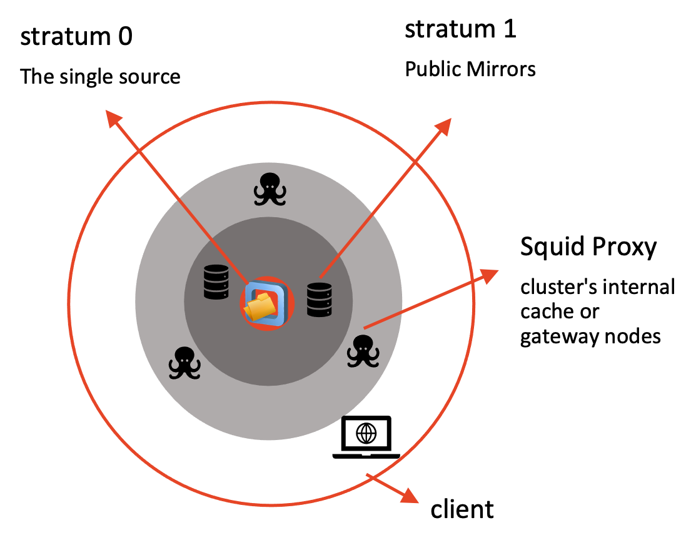

# CVMFS

**CVMFS** mounts a shared, read-only library of scientific software/containers over HTTP — nothing is downloaded until you touch it.

## 1. The mountpoint before anything is mounted

```bash
cd /cvmfs
```

```bash
ls
```

Nothing is listed. `/cvmfs` is managed by **autofs** — repositories only appear the moment something tries to access them. An empty `ls /cvmfs` is expected: nothing is "mounted" until it's touched.

## 2. Probe the client

```bash
cvmfs_config probe
```

```text
Probing /cvmfs/data.galaxyproject.org... OK
```

This attempts to mount and stat every repository listed in `CVMFS_REPOSITORIES` (`/etc/cvmfs/default.local`) and reports OK/FAIL per repo. Only `data.galaxyproject.org` is configured right now — the **singularity** repo (`singularity.galaxyproject.org`) has deliberately been left out so we can add it back in live.

## 3. The configuration files

CVMFS reads config in layers. Before diving into individual files, here's the architecture those layers are configuring:



Each ring in the diagram maps to a config group below:

- **Stratum 0** — the single source repository, where publishers push changes. It's not part of client config at all; everything below is about how a *client* reaches a read-only copy of it.
- **Stratum 1** (public mirrors) — configured under **domain and repo**, in `CVMFS_SERVER_URL`.
- **Squid Proxy** (cluster's internal cache/gateway) — configured under **config files (default + global)**, in `CVMFS_HTTP_PROXY`.
- **Client** (this VM, at the bottom of the diagram) — brought into the picture by **system mount** (autofs) and **config files** (`CVMFS_REPOSITORIES`, cache settings).

Walk through it in the same four logical groups: config files (default + global), domain and repo, security keys, and system mount.

### Config files (default + global)

#### `/etc/cvmfs/default.conf`

```bash
cat /etc/cvmfs/default.conf
```

Shipped by the `cvmfs` package — global defaults for **all** repositories (cache location/quota, timeouts, retry/backoff, key directory). **Never edit this file directly**; override values in `default.local` instead.

```conf
CVMFS_CACHE_BASE=/var/lib/cvmfs   # local disk cache directory
CVMFS_QUOTA_LIMIT=4000            # cache size cap in MB
CVMFS_SHARED_CACHE=yes            # one shared cache for all repos on this client, not one per repo
CVMFS_KEYS_DIR=/etc/cvmfs/keys    # directory of public keys
CVMFS_TIMEOUT=5                   # seconds to wait on a proxied connection before retry/failover
CVMFS_TIMEOUT_DIRECT=10           # seconds to wait on a direct (non-proxied) connection before retry/failover
CVMFS_USE_GEOAPI=no               # use GeoIP to pick the nearest Stratum 1 server
```

Check how much of `CVMFS_CACHE_BASE` is actually in use — `-s` gives just the total instead of every subdirectory, and `sudo` is needed since the cache is owned by the `cvmfs` service, not your user:

```bash
sudo du -sh /var/lib/cvmfs/
```

CVMFS treats `CVMFS_QUOTA_LIMIT` (in MB) as a soft cap on this cache directory — once it's exceeded, the least recently used files are evicted automatically to make room, rather than the client erroring out.

!!! note
    `CVMFS_USE_GEOAPI=no` is the package default — fine generically, but **not what we want for Galaxy**: the galaxyproject.org domain has Stratum 1 replicas spread across the globe (TACC, IU, PSU, JRC in the EU, GVL in Australia). Without GeoAPI, the client just walks the server list in the order it's written rather than picking the closest one. `default.local` overrides this back to `yes`.

#### `/etc/cvmfs/default.local`

```bash
cat /etc/cvmfs/default.local
```

```conf
CVMFS_REPOSITORIES=data.galaxyproject.org
CVMFS_HTTP_PROXY='DIRECT'
CVMFS_QUOTA_LIMIT=4096
CVMFS_USE_GEOAPI=yes
```

Site-local overrides layered on top of `default.conf` — this is where **which repos to mount** and proxy/quota settings actually live for this machine.

!!! note
    `CVMFS_HTTP_PROXY='DIRECT'` because this box is on Nectar, which has no Squid proxy set up — every client talks straight to the Stratum 1 servers. Compare with Nirin, which does have Squid proxies available and sets a proxy IP address so its hosts route through those instead of going direct.

### Domain and repo

#### `/etc/cvmfs/domain.d/galaxyproject.org.conf`

```bash
cat /etc/cvmfs/domain.d/galaxyproject.org.conf
```

```conf
CVMFS_SERVER_URL="http://cvmfs1-tacc0.galaxyproject.org/cvmfs/@fqrn@;http://cvmfs1-iu0.galaxyproject.org/cvmfs/@fqrn@;http://cvmfs1-psu0.galaxyproject.org/cvmfs/@fqrn@;http://galaxy.jrc.ec.europa.eu:8008/cvmfs/@fqrn@;http://cvmfs1-mel0.gvl.org.au/cvmfs/@fqrn@"
CVMFS_KEYS_DIR="/etc/cvmfs/keys/galaxyproject.org"
```

Domain-level config — anything ending in `.galaxyproject.org` inherits this: the Stratum 1 replica list and the key directory for signature verification. `@fqrn@` is substituted per-repo, so one config line covers every `*.galaxyproject.org` repo.

Broken out one server per line, this is the full replica list `CVMFS_SERVER_URL` is packing into a single value:

```conf
CVMFS_SERVER_URL="
  http://cvmfs1-tacc0.galaxyproject.org/cvmfs/@fqrn@;      # 1. TACC (Texas)
  http://cvmfs1-iu0.galaxyproject.org/cvmfs/@fqrn@;        # 2. IU (Indiana)
  http://cvmfs1-psu0.galaxyproject.org/cvmfs/@fqrn@;       # 3. PSU (Pennsylvania)
  http://galaxy.jrc.ec.europa.eu:8008/cvmfs/@fqrn@;        # 4. Europe (JRC)
  http://cvmfs1-mel0.gvl.org.au/cvmfs/@fqrn@               # 5. Australia (Melbourne)
"
```

Geographic spread:

- 3 in the USA — TACC, IU, PSU
- 1 in Europe — Joint Research Centre (JRC)
- 1 in Australia — GVL, Genomics Virtual Lab (Melbourne)

!!! note "Why this matters"
    CVMFS tries these servers in order and, once GeoAPI is enabled (see the note above), picks the fastest/closest one automatically. In practice: users in the US typically land on TACC/IU/PSU, users in Europe get JRC, and users in Australia get Melbourne — all served from the same single server list.

### Security keys

#### `/etc/cvmfs/keys/galaxyproject.org/`

```bash
ls /etc/cvmfs/keys/galaxyproject.org/
```

```text
data.galaxyproject.org.pub
singularity.galaxyproject.org.pub
```

Take a look at the keys themselves:

```bash
cat /etc/cvmfs/keys/galaxyproject.org/*
```

```text
-----BEGIN PUBLIC KEY-----
MIIBIjANBgkqhkiG9w0BAQEFAAOCAQ8AMIIBCgKCAQEA5LHQuKWzcX5iBbCGsXGt
6CRi9+a9cKZG4UlX/lJukEJ+3dSxVDWJs88PSdLk+E25494oU56hB8YeVq+W8AQE
...
owIDAQAB
-----END PUBLIC KEY-----
-----BEGIN PUBLIC KEY-----
MIIBIjANBgkqhkiG9w0BAQEFAAOCAQ8AMIIBCgKCAQEAuJZTWTY3/dBfspFKifv8
TWuuT2Zzoo1cAskKpKu5gsUAyDFbZfYBEy91qbLPC3TuUm2zdPNsjCQbbq1Liufk
...
dQIDAQAB
-----END PUBLIC KEY-----
```

Two standard RSA public keys in PEM format — one per repo (`data.galaxyproject.org`, `singularity.galaxyproject.org`), used to verify the cryptographic signature on each repository's root catalog. These are the counterparts to the private keys the repo publishers hold. Both keys are already present — adding the singularity repo back in doesn't require fetching a new key, just telling CVMFS to use it.

!!! info "Security: why plain HTTP is safe here"
    CVMFS doesn't rely on HTTPS for integrity. Every file is content-addressed by its cryptographic hash, and the repository's root catalog is digitally signed with the private key matching the `.pub` file shown above. If a Stratum 1 server ever served tampered or corrupted data, the client would detect the hash/signature mismatch and refuse it — regardless of the transport being plain HTTP. The mount is also strictly **read-only**: not even root can write to `/cvmfs`, so content can only change via the repository's official publishing process, never from the client side.

### System mount

#### `/etc/auto.master.d/cvmfs.autofs`

```bash
cat /etc/auto.master.d/cvmfs.autofs
```

```text
/cvmfs /etc/auto.cvmfs
```

The autofs map entry that makes `/cvmfs` an automount point in the first place. `/etc/auto.cvmfs` is the CVMFS-provided automount helper — this is the piece that made `ls /cvmfs` come back empty in step 1: nothing is mounted until autofs is asked to resolve a path under it.

## 4. Add the singularity repo back in

```bash
sudo sed -i 's/CVMFS_REPOSITORIES=data.galaxyproject.org/CVMFS_REPOSITORIES=data.galaxyproject.org,singularity.galaxyproject.org/' /etc/cvmfs/default.local
```

Check the line was updated correctly:

```bash
cat /etc/cvmfs/default.local
```

If it looks right, re-probe:

```bash
cvmfs_config probe
```

We expect two repositories to be available now:

```text
Probing /cvmfs/data.galaxyproject.org... OK
Probing /cvmfs/singularity.galaxyproject.org... OK
```

`ls /cvmfs` now shows both repos mounted.

!!! note "How this is actually rolled out"
    We edited `default.local` by hand here for the demo, but on a real cluster you don't want to hand-edit config on every compute node. **BioShell** itself is built and configured with Ansible — see the [`cvmfs` role](https://github.com/AustralianBioCommons/BioShell/blob/main/build/ansible/roles/cvmfs/tasks/main.yml) for how `CVMFS_REPOSITORIES` and the rest of this config are templated out consistently across every node.

## 5. Explore the singularity repo

```bash
ls /cvmfs/singularity.galaxyproject.org/
```

```text
1  2  3  a  all  b  c  d  e  f  g  h  i  j  k  l  m  n  o  p  q  r  s  t  u  v  w  x  y  z
```

The single-character directories are a two-level alphabetical index meant to help you find tooling without listing everything at once. For example, `s/a/` holds symlinks for every tool starting `sa...`, pointing back into `all`:

```bash
ls -la /cvmfs/singularity.galaxyproject.org/s/a | head -6
```

```text
sabre:1.000--h577a1d6_6 -> ../../all/sabre:1.000--h577a1d6_6
sabre:1.000--h5bf99c6_2 -> ../../all/sabre:1.000--h5bf99c6_2
sabre:1.000--h7132678_3 -> ../../all/sabre:1.000--h7132678_3
```

It helps, but only if you already know the tool's first two letters — `s/` alone has 25 subdirectories and `s/a/` alone has 777 entries. In practice, `all` + `grep` is faster than walking the index by hand:

```bash
ls /cvmfs/singularity.galaxyproject.org/all | wc -l
```

```text
122777
```

**122,777 containers** in one directory — every Bioconda/Biocontainers image Galaxy has ever pulled in. Too many to browse by eye, so you search for what you want:

```bash
ls /cvmfs/singularity.galaxyproject.org/all | grep '^samtools:'
```

```text
samtools:0.1.12--0
samtools:0.1.12--1
samtools:0.1.13--0
...
samtools:1.9--h91753b0_8
```

138 versions of `samtools` alone. Naming convention is `<tool>:<version>--<build>`, matching the Bioconda/Biocontainers tag scheme — the same naming SHPC and Shelley key off of next.

Check the cache again, now that we've browsed both repos:

```bash
sudo du -sh /var/lib/cvmfs/
```

Bigger than the [first check](#etccvmfsdefaultconf) — every `ls` and `cat` above touched directory catalogs that CVMFS had to fetch and cache, even though we never downloaded a full container image.

**Next: [SHPC](shpc.md)**
