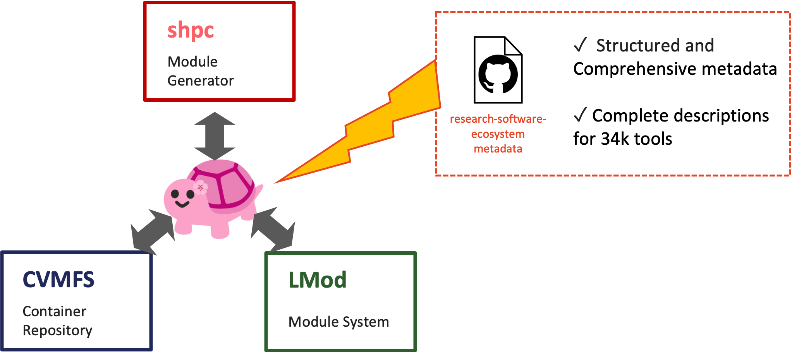

# Shelley

**Shelley** ([source](https://github.com/Sydney-Informatics-Hub/shelley)) wraps SHPC into a single guided command, so building a module from a CVMFS container is one step instead of many. It automates everything we just did by hand in [SHPC, step 7](shpc.md#7-installing-a-tag-that-isnt-in-the-registry). It's a CVMFS/SHPC-aware CLI (with a TUI mode) that turns *find the container → check the registry → patch a local recipe → install* into a single `shelley build` call.



Shelley sits in the middle as an orchestrator between three pieces we've already met — **CVMFS** (the container repository), **shpc** (the module generator), and **LMod** (the module system) — and adds a fourth: structured metadata from the [research-software-ecosystem](https://github.com/research-software-ecosystem/content) project, with descriptions for 34k tools. That last piece is what powers the description panels in `shelley find` below, and is exactly the metadata source referenced in [Why metadata matters](#why-metadata-matters) at the end of this page.

## 1. Interactive mode

```bash
shelley interactive
```

Opens a full-screen TUI with its own command grammar:

```text
Available Commands
Command                Description                                     Example
find <tool> [-v|-vv]   Find a tool; -v all versions, -vv adds paths    find fastqc
search <terms>         Search for tools by description                 search quality control
build <tool[/ver]>     Build an Lmod module for a tool                  build samtools/1.21
help                   Show this help table                            help
exit                   Exit interactive mode
```

`exit` (or Ctrl-C) drops back to the shell.

## 2. Look up a tool

```bash
shelley find samtools
```

Renders a description panel (homepage, operations, inputs/outputs — pulled from the same shpc-registry metadata), then a version table:

```text
Available Versions
Versions    Buildable  Installed
1.23.1      ✓          ✗
1.23        ✓          ✗
1.22.1      ✓          ✗
1.22        ✓          ✗
1.21        ✓          ✓
+ 35 more              shelley find samtools -v
```

```text
Buildable ✗: Versions not in the shpc registry may still be built, but can take a few minutes longer.
Installed ✓: This version is already available to module load on this system.
```

Shelley is surfacing exactly the two facts that took a full manual walkthrough to establish with SHPC: whether a version has a registry recipe already, and whether it's already built as a module here. `1.21` shows **Installed ✓** — that's the module we built by hand earlier.

## 3. See every CVMFS build, and where they're located on CVMFS

```bash
shelley find samtools -vv
```

`-vv` adds the CVMFS path per tag and switches to a paginated table — **136 total** builds available for samtools (vs. the ~19 the shpc-registry recipe knows about):

```text
Available Builds (136 total) — page 1 of 14
Versions             Buildable  Installed  Container Path
1.23.1--ha83d96e_0   ✓          ✗          /cvmfs/singularity.galaxyproject.org/all/samtools:1.23.1--ha83d96e_0
1.21--h50ea8bc_0     ✓          ✓          /cvmfs/singularity.galaxyproject.org/all/samtools:1.21--h50ea8bc_0
1.21--h96c455f_1     ✓          ✓          /cvmfs/singularity.galaxyproject.org/all/samtools:1.21--h96c455f_1
...
1.5--0               ✗          ✗          /cvmfs/singularity.galaxyproject.org/all/samtools:1.5--0
```

Every row is a build Shelley found by scanning `/cvmfs/singularity.galaxyproject.org/all` directly — the same directory (and the same "too many to browse" problem) from [CVMFS, step 5](cvmfs.md#5-explore-the-singularity-repo) — now with a paged, filterable view instead of raw `ls | grep`.

## 4. Build a version that isn't in the registry — one command

```bash
shelley build samtools:1.5--2
```

Under the hood this runs the same manual sequence from [SHPC, step 7](shpc.md#7-installing-a-tag-that-isnt-in-the-registry) — diffing container layers, extracting the filesystem, subtracting out common base-image layers (`alpine`, `busybox`, `ubuntu`, miniconda, etc. — "removed N shared paths") to isolate what's unique to this container — but as one command:

```text
Generating diff for /cvmfs/singularity.galaxyproject.org/all/samtools:1.5--2
...
⚠️  quay.io/biocontainers/samtools:1.5--2 is not in the upstream shpc-registry. A local entry has been created in /apps/local.

✅ Module Built Successfully!
Tool: samtools
Version: 1.5--2
Module Path: /apps/Modules/modulefiles/samtools/1.5--2.lua

To load this module:
module load samtools/1.5--2
```

!!! tip
    Compare this to SHPC step 7: create a directory, `curl` the upstream recipe, register the local registry, `sha256sum` the image, hand-edit the YAML, then `shpc install`. Shelley collapses all of that into one command — it detects the tag is untracked, generates the local registry entry itself (in `/apps/local`, the site-wide equivalent of the `~/shpc/registry/local/` we built by hand), computes the checksum, and builds the module.

One more difference worth noting: this module lands at `/apps/Modules/modulefiles/samtools/1.5--2.lua` — the **site-wide** Environment Modules tree (same place `R`, `nextflow`, `snakemake`, etc. already live) — not the personal `~/shpc/modules/` tree `shpc install` wrote to with SHPC. Shelley builds modules for the whole system to use, not just the current user.

## 5. Load it

```bash
module avail
```

```text
--- /apps/Modules/modulefiles ---
   R/4.3.3   ansible/2.16.3   jupyter/2026.07   nextflow/26.04.4   nf-core/4.0.2   plink/1.90b7.7--h7b50bb2_0   rstudio/2026.06.0   samtools/1.5--2   samtools/1.21--h96c455f_1   snakemake/7.32.4
```

`samtools/1.5--2` now sits alongside the site's existing modules.

```bash
module load samtools/1.5--2
```

```text
The following have been reloaded with a version change:
  1) samtools/1.0--0/module => samtools/1.5--2
```

End to end: a container version nobody had registered anywhere, sitting in CVMFS since who-knows-when, built into a real system module and loaded — with one command instead of many.

## Why metadata matters

Shelley started as an attempt to simplify the deeply nested, hard-to-browse Singularity image tree in CVMFS — the same `all/` directory with 120,000+ entries from the [CVMFS page](cvmfs.md#5-explore-the-singularity-repo) — into something researchers can actually search and understand, rather than `ls | grep` their way through.

For tools, that's working: the description panels and metadata `shelley find` renders come from the [Research Software Ecosystem Content](https://github.com/research-software-ecosystem/content) project. For reference data (genomes, annotations, and similar) sitting in CVMFS, there isn't yet a clear equivalent source of metadata — that's still an open problem we're actively looking into.

!!! note
    Researchers need support finding what they're looking for, not just a mount point. How you structure and expose metadata — both in how a CVMFS repository is organised and in the downstream access tools built on top of it — deserves as much design consideration as the mounting and module-building mechanics covered in this demo.
