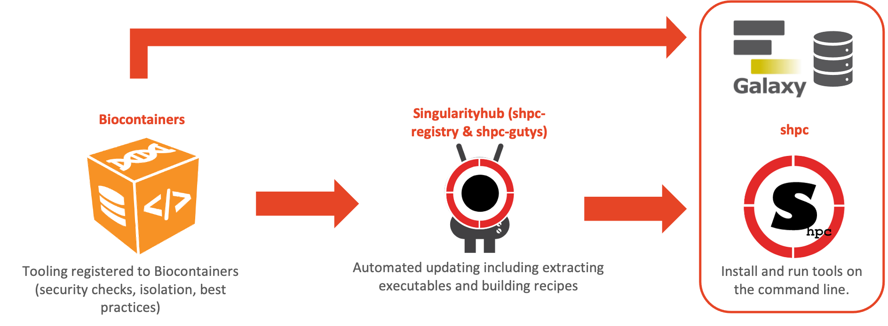
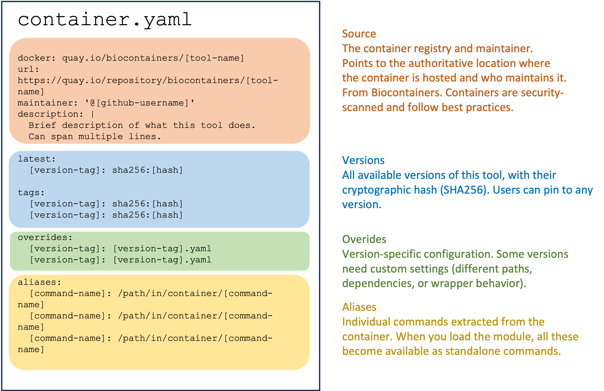
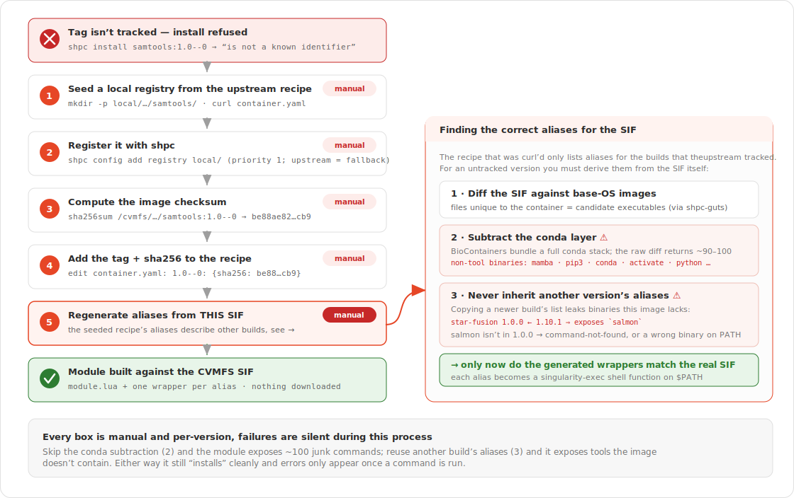

# SHPC (Singularity Registry HPC)

Exposing a biocontainer as an Lmod module by hand means writing and maintaining a `.lua` modulefile for every tool and version — wiring up the `singularity exec` wrappers, aliases, and `$PATH` entries yourself, then repeating that for the tens of thousands of images in the Biocontainers catalogue. That doesn't scale. **SHPC** removes the hand-maintenance by generating those modules automatically.

**SHPC** allows the installation of software containers in the form of "container modules", for transparent usage of containerised applications, including images already sitting in CVMFS. An automated process generates a system module for an application, hiding the specificities of the Singularity syntax behind shell functions that take the same name as the corresponding executables.



This is the pipeline that puts a tool in front of you as a module:

1. **Biocontainers** — tooling registered to Biocontainers, with security checks, isolation, and best practices already applied upstream.
2. **SingularityHub** (`shpc-registry` & `shpc-gutys`) — automated updating that extracts executables from each container and builds the recipe (the `container.yaml` you patched by hand in [step 7](#7-installing-a-tag-that-isnt-in-the-registry)).
3. **shpc** — installs and runs those tools on the command line, as an Lmod module.

The same Biocontainers images also flow into **Galaxy**'s CVMFS repository (the top arrow) — which is exactly why the containers you installed with `shpc` in this demo are the same ones already sitting in `/cvmfs/singularity.galaxyproject.org/all/`.

## 1. Load the module

Go to your home directory and check what's available before loading anything:

```bash
cd
module avail
```

Load SHPC:

```bash
module load shpc
```

Check `module avail` again:

```bash
module avail
```

`singularity` got pulled in too — `shpc` depends on it, so loading `shpc` auto-loads `singularity` as well.

## 2. Where SHPC gets its registry from

```bash
cat /opt/shpc/singularity-hpc/shpc/settings.yml
```

```yaml
registry: [https://github.com/singularityhub/shpc-registry]
```

SHPC reads recipe entries (maintainer, description, available tags/aliases) from the community-maintained `shpc-registry` repo on GitHub. The actual container image still comes from wherever the recipe's `docker:` field points — `quay.io/biocontainers` in our case.

## 3. Search and inspect an entry

```bash
shpc show -f samtools
```

```text
ghcr.io/autamus/samtools
quay.io/biocontainers/bioconductor-rsamtools
quay.io/biocontainers/msamtools
quay.io/biocontainers/perl-bio-samtools
quay.io/biocontainers/samtools
```

`-f` fuzzy-matches on the name, so a few unrelated tools show up alongside the one we want: `quay.io/biocontainers/samtools`.

```bash
shpc show quay.io/biocontainers/samtools
```

```yaml
url: https://biocontainers.pro/tools/samtools
maintainer: '@vsoch'
description: shpc-registry automated BioContainers addition for samtools
latest:
  1.23.1--ha83d96e_0:
    sha256:23cda33a3a42125872766df9aaf1d2db67cdb8c85314b793465188435af31ba6
tags:
  1.10--h2e538c0_3:
    sha256:84a8d0c0acec87448a47cefa60c4f4a545887239fcd7984a58b48e7a6ac86390
  ...
  1.23.1--ha83d96e_0:
    sha256:23cda33a3a42125872766df9aaf1d2db67cdb8c85314b793465188435af31ba6
docker: quay.io/biocontainers/samtools
aliases:
  bgzip: /usr/local/bin/bgzip
  htsfile: /usr/local/bin/htsfile
  samtools: /usr/local/bin/samtools
  tabix: /usr/local/bin/tabix
  ...
```

Every tag is pinned by sha256, and `aliases` lists the binaries inside the container that SHPC will expose as individual commands.

That output is just a rendered view of the recipe's underlying `container.yaml`. Here's the anatomy of one:



For the full recipe spec and more advanced options than covered here, see the [SHPC developer guide](https://singularity-hpc.readthedocs.io/en/latest/getting_started/developer-guide.html).

## 4. Install pointing at the CVMFS copy, not a fresh download

By default `shpc install` pulls the image straight from the registry (`docker://...`). We already have this exact image in CVMFS, so point at it instead:

```bash
ls /cvmfs/singularity.galaxyproject.org/all/samtools*1.23.1--ha83d96e_0
```

```text
/cvmfs/singularity.galaxyproject.org/all/samtools:1.23.1--ha83d96e_0
```

```bash
shpc install quay.io/biocontainers/samtools:1.23.1--ha83d96e_0 /cvmfs/singularity.galaxyproject.org/all/samtools:1.23.1--ha83d96e_0 --keep-path
```

```text
Module quay.io/biocontainers/samtools:1.23.1--ha83d96e_0 was created.
```

The syntax names the tool twice — once as the registry identifier (for metadata/aliases), once as the literal CVMFS path (the actual image) — but this is what lets SHPC build a module against an already-mounted image instead of fetching a new copy.

## 5. What `install` creates

```bash
tree ~/shpc/
```

```text
shpc/
├── modules
│   └── quay.io/biocontainers/samtools/1.23.1--ha83d96e_0/module.lua
└── wrappers
    └── quay.io/biocontainers/samtools/1.23.1--ha83d96e_0/
        ├── 99-shpc.sh
        └── bin/  (bgzip, htsfile, samtools, samtools-run, samtools-shell, tabix, ...)
```

Two parallel trees, both keyed by `<registry>/<org>/<tool>/<version>`:

- **`modules/`** — the Lmod `module.lua` file that `module load` reads
- **`wrappers/`** — one shell script per alias, plus every real binary inside the container — these are what end up on `$PATH` once the module is loaded

### The module file

```bash
cat ~/shpc/modules/quay.io/biocontainers/samtools/1.23.1--ha83d96e_0/module.lua
```

Here are the key parts of this module file:

- **Container path** — the most critical piece; everything else in the module is built around this
- **All tools exposed as commands** — every binary in the container becomes a shell function
- **Environment variables** users can control
- **Wrapper directory location** — needs to exist and be readable by all users for global access
- **Conflict declarations** — prevent loading multiple versions simultaneously

### The wrapper file

```bash
cat ~/shpc/wrappers/quay.io/biocontainers/samtools/1.23.1--ha83d96e_0/bin/htsfile
```

```bash
#!/bin/bash

script=`realpath $0`
wrapperDir=`dirname $script`/..

singularity ${SINGULARITY_OPTS} exec ${SINGULARITY_COMMAND_OPTS} -B $wrapperDir/99-shpc.sh:/.singularity.d/env/99-shpc.sh   /cvmfs/singularity.galaxyproject.org/all/samtools:1.23.1--ha83d96e_0 /usr/local/bin/htsfile "$@"
```

Every alias script is a thin `singularity exec` wrapper, and the image path it runs against is the **CVMFS path**, not a locally cached copy. `htsfile`, `samtools`, `bgzip`, etc. all become ordinary commands on `$PATH` once the module is loaded, running straight out of CVMFS — no image download, no local disk usage for the container itself.

## 6. Make the module visible and inspect a wrapper

Once installed, the module is not immediately visible in the tool paths:

```bash
module avail
```

Add the module path to Lmod so that it shows up when available modules are inspected:

```bash
module use ~/shpc/modules/quay.io/biocontainers
```

Check again:

```bash
module avail
```

Load the module:

```bash
module load samtools/1.23.1--ha83d96e_0/module
```

Check it's the correct version:

```bash
samtools --version
```

## 7. Installing a tag that isn't in the registry

CVMFS has far more versions mounted than the shpc-registry recipe knows about. The build `samtools:1.0--0` exists under `/cvmfs/singularity.galaxyproject.org/all/`, but predates the range of tags the registry maintainer added.

This flowchart captures the steps involved in installing a tag locally.



```bash
shpc install quay.io/biocontainers/samtools:1.0--0 /cvmfs/singularity.galaxyproject.org/all/samtools:1.0--0 --keep-path
```

```text
quay.io/biocontainers/samtools:1.0--0 is not a known identifier. Valid tags are:
1.10--h2e538c0_3
1.11--h6270b1f_0
...
1.23.1--ha83d96e_0
```

SHPC validates against the tags listed in the recipe's `container.yaml` — it won't take just any path. To install an untracked tag, add a **local registry** with a `container.yaml` that includes it.

Seed a local registry from the upstream recipe, in the same nested layout shpc expects:

```bash
mkdir -p shpc/registry/local/quay.io/biocontainers/samtools
```

```bash
curl -fsSL \
  https://raw.githubusercontent.com/singularityhub/shpc-registry/main/quay.io/biocontainers/samtools/container.yaml \
  -o shpc/registry/local/quay.io/biocontainers/samtools/container.yaml
```

Register it with shpc — the local registry takes priority, upstream stays as a fallback:

```bash
shpc config add registry shpc/registry/local/
```

Check it took effect:

```bash
shpc config get registry
```

```text
['shpc/registry/local/', 'https://github.com/singularityhub/shpc-registry']
```

Get the checksum for the untracked tag and add it to the local recipe:

```bash
sha256sum /cvmfs/singularity.galaxyproject.org/all/samtools:1.0--0
```

```text
be88ae82e3ba7c650be087fb29bd80505982d092fb69f0913c17892fd7422cb9  /cvmfs/singularity.galaxyproject.org/all/samtools:1.0--0
```

Edit `shpc/registry/local/quay.io/biocontainers/samtools/container.yaml` and add the new tag under `tags:`:

```yaml
  1.0--0:
    sha256:be88ae82e3ba7c650be087fb29bd80505982d092fb69f0913c17892fd7422cb9
```

Install again:

```bash
shpc install quay.io/biocontainers/samtools:1.0--0 /cvmfs/singularity.galaxyproject.org/all/samtools:1.0--0 --keep-path
```

```text
Module quay.io/biocontainers/samtools:1.0--0 was created.
```

!!! tip
    The recipe is really just metadata plus a checksum allowlist — as long as a tag/sha256 is declared somewhere in a registry shpc knows about, it will build a module against any image, including ones the upstream shpc-registry never heard of. This is exactly how you'd onboard a locally-built or CVMFS-only container.

## 8. Load it and use it

```bash
module load samtools/1.0--0/module
```

```text
The following have been reloaded with a version change:
  1) samtools/1.23.1--ha83d96e_0/module => samtools/1.0--0/module
```

Swaps straight over the module loaded earlier — Lmod handles the version switch, no need to unload first.

```bash
samtools --version
```

```text
samtools 1.0
Using htslib 1.0
Copyright (C) 2014 Genome Research Ltd.
```

That's the exact ancient container we hand-registered a minute ago, invoked as an ordinary command, sourced live from CVMFS with nothing downloaded to local disk.

## Maintaining your own registry

You don't have to rely on the upstream shpc-registry at all — you can maintain your own registry for your users instead, as described in the [developer guide: creating a filesystem registry](https://singularity-hpc.readthedocs.io/en/latest/getting_started/developer-guide.html#creating-a-filesystem-registry):

> A filesystem registry consists of a database of local containers files, which are added to the module system as executables for your user base. This typically means that you are a linux administrator of your cluster, and shpc should be installed for you to use (but your users will not be interacting with it).

Running your own registry has some real advantages over relying purely on upstream:

- **Register anything, not just what upstream has gotten to** — CVMFS had 136 samtools builds in this demo, the community registry only tracked ~19
- **No dependency on GitHub being reachable** — the upstream registry is fetched from `github.com/singularityhub/shpc-registry`; a local registry works entirely offline
- **You control exactly what's trusted** — every entry is a tag pinned to a sha256 you computed yourself, not one approved by upstream maintainers
- **Override or fix a bad/stale upstream recipe** — local registries take priority over upstream, so you can supersede a wrong or outdated entry without forking the whole registry
- **Faster iteration** — add a version the moment your users need it, rather than waiting on an upstream PR and review

!!! warning
    Registering an untracked tag as shown in step 7 only copies over the `aliases` from the upstream recipe you seeded from. If that unregistered version actually ships additional binaries the upstream recipe doesn't list — a newer or older build with extra tools bundled in — those commands won't be exposed automatically. You'll need to inspect the container yourself and add the missing entries to the `aliases` section of your local `container.yaml` by hand before `shpc install` will generate wrappers for them.

**Next: [Shelley](shelley.md)**
